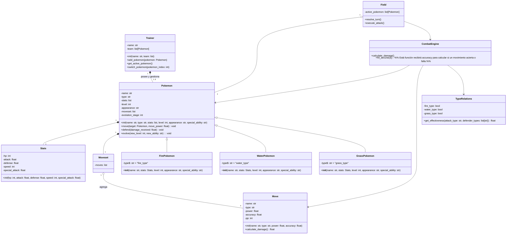

# POKE

# Resolución Actividad 1: Clase Pokemon 
## Objetivos 
1. Desarrollar la clase Pokemon.
2. Definir 10 características que posee la clase Pokemon.
3. Definir 3 Acciones que puede realizar la clase Pokemon.
4. Proponer su estructura constructor.
5. Elaborar un diagrama tipo UML inicial de la clase.
6. Los atributos tengan sentido dentro del modelo.
7. Los métodos sean realistas e implementables.

> Cómo cumplimiento de los objetivos se hace entrega del presente documento, donde se trazó todo el curso y puesta en marcha del procedimiento. 
---

## Tabla de contenidos
- [POKE](#poke)
- [Resolución Actividad 1: Clase Pokemon](#resolución-actividad-1-clase-pokemon)
  - [Objetivos](#objetivos)
  - [Tabla de contenidos](#tabla-de-contenidos)
  - [Contextualizacion](#contextualizacion)
  - [Diseño de clase](#diseño-de-clase)
      - [Constructor de clase pokemon](#constructor-de-clase-pokemon)
  - [Diagrama UML](#diagrama-uml)


## Contextualizacion

Para dar un buen inicio, se debe comprender el cómo se usaría la teoría de Pokémon y por qué se puede abstraer y relacionar con la Programación Orientada a Objetos.

## Diseño de clase 

A partir de lo descrito, Basándonos en la franquicia y videojuegos de pokemon, se propone cómo clase principal para nuestro diseño la entidad *POKEMON*, abstraida con atributos generales cómo: 

- ***Puntos de vida*** : Al ser una entidad viva capacitada para combatir, nos basamos en los puntos de vida cómo parametro de control, el cuál cambiara su valor constantemente durante un combate.
- ***Tipo*** : Atributo general que define los diversos caminos de cómo interactuará un pokemon en el entorno.
- ***Nombre***: Puesto que todo objeto necesita un identificador legible para el usuario y diferenciable de todo pokemon.
- ***Aspecto*** : Característica que permite visualizar con mayor detalle a cada objeto.
- ***Fuerza base***: Determina el daño que puede causar
- ***Nivel*** : Atributo pivote, capaz de moderar los atributos generales del pokemon, modificable a partir de una acción de mejora que posea el pokemon.
- ***Habilidad** especial* : Como medio de ataque el pokémon poseerá una habilidad individual que altere la fuerza y resistencia del pokemon, generando mayor diversidad y campo de juego en las relaciones.
- ***Ataques***  : Acciones consecutivas en el campo de batalla, cada una poseerá una característica especial, aumentando la variabilidad de sus estadísticas.
- ***Evolución*** : Medida importante que rastrea el desarrollo del objeto, capaz de modificar su atributo *Nivel* a partir de una acción controlada.
- ***Defensa*** : Valor numérico de resistencia inherente que actúa como reductor del impacto recibido por una Fuerza base o Habilidad especial externa

Finalmente, aunque muchas características sean bienvenidas, se consideran cómo las fundamentales y generales para la relación de un pokemon en el mundo virtual.

Por otro lado, a partir de estás características, el pokemon se comportará en un ambiente de combate con acciones que todos los objetos poseen:  
- ***Attack(target: Pokemon, attack_power: float): void***  
Acción fundamental para la interacción entre objetos. Reduce los puntos de vida del objetivo en función del poder de ataque.  
***Parametros***:  
-target (Pokemon): Pokemon que recibirá el ataque.  
-attack_power (float): Cantidad de daño que se aplicará al objetivo.  
  
- ***Defend(damage_received: float): void***  
Acción que permite al pokemon reducir el daño recibido durante un ataque, utilizando su capacidad de defensa.  
***Parámetros***:  
damage_received (float):  Cantidad de daño que el pokemon recibe antes de aplicar la defensa.  

- ***Evolve(new_level: int, new_ability: str): void***  
Acción que permite al pokemon aumentar su nivel y mejorar sus estadísticas, pudiendo también adquirir una nueva habilidad especial.  
***Parámetros***:  
-new_level (int): Nivel al que evolucionará el pokemon.  
-new_ability (str): Nueva habilidad que puede adquirir al evolucionar.  

---

#### Constructor de clase pokemon


```bash
- CONSTRUCTOR(health_points: int, base_strength: float, defense_capacity: float,
            level: int, type: str, appearance: str, special_ability: str)
```

--- 

## Diagrama UML

Se utiliza los tres metodos principales de ataque, defensa y evolucionar, con sus respectivos atributos para controlar el comportamiento del pokemon en el entorno de combate, además de los atributos generales que caracterizan a cada pokemon.

Siendo valido que se puedan usar estos metodos, aunque en el futuro se puedan agregar más, pero estos son los generales para la interacción entre pokemones.
